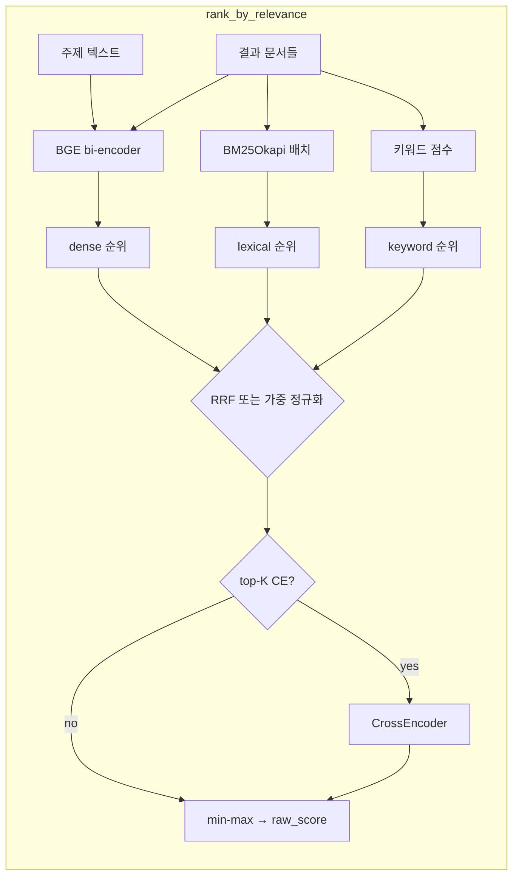

# Research Aggregator — 워크플로 README (한국어)

Colab 내보낸 스크립트 **`research_aggregator_group3.py`** 기준: 검색부터 출력·캐시까지의 흐름입니다.

---

## 개요

1. 여러 소스에서 논문·게시물·웹 결과 수집  
2. **BGE dense + BM25 + 키워드**를 RRF 또는 정규화 가중합으로 융합해 관련도 정렬  
3. (선택) **크로스 인코더**로 상위 K건 재순위  
4. 신뢰도 → 중복 제거 → 초록 요약 → SQLite 캐시 저장 및 출력  

랭킹 상세는 **`research_aggregator_RANKING_UPDATE_KR.md`** 참고.

---

## 사전 준비

- **패키지:** 스크립트 첫 셀에서 `sentence-transformers`, `torch`, `rank-bm25`, `httpx`, `scholarly` 등 설치  
- **Serper API 키:** Serper 설정 셀(환경 변수)  
- **리소스:** `bge-base` + cross-encoder는 GPU/메모리 부담이 큼. 부족하면 `bge-small-en-v1.5` 또는 `RANK_CROSS_ENCODER_TOP_K = 0`  

---

## 파이프라인 단계 (`run_pipeline`)

| 단계 | 내용 |
|------|------|
| 1 | **캐시** — `find_similar_query(topic)` (다국어 MiniLM 임베딩 유사도) |
| 2 | **수집** — `scrape_all`: Scholar, X, Threads, Web |
| 3 | **랭킹** — `rank_by_relevance`: BGE / BM25 / keyword → `rrf` 또는 `weighted_norm` → (선택) CE → `raw_score`, `semantic_score`, `bm25_score`, … |
| 4 | **신뢰도** — `score_all_reliability` |
| 5 | **중복 제거** — `deduplicate` |
| 6 | **요약** — `summarize_abstracts` |
| 7 | **캐시** — `save_to_cache` (`DB_PATH` SQLite) |

---

## 랭킹 내부 흐름 (Mermaid)

---

## 데이터 소스

- **Scholar:** scholarly → 실패 시 Serper Scholar  
- **X / Threads:** Serper 후 게시물 내 논문 링크 추출  
- **Web:** Serper 일반 검색  

랭킹 입력 텍스트: 제목·스니펫·저자·venue.

---

## 설정 요약표

| 이름 | 기본 | 설명 |
|------|------|------|
| `RANK_BI_ENCODER_MODEL_NAME` | `BAAI/bge-base-en-v1.5` | 영어 바이 인코더 |
| `RANK_MERGE_MODE` | `rrf` | `weighted_norm` 으로 변경 가능 |
| `RANK_CROSS_ENCODER_TOP_K` | 40 | `0` 이면 CE 끔 |
| `_get_cache_embed_model` | 다국어 MiniLM | **캐시 질의 유사도만** (랭커와 별도) |

---

## 문제 해결

- **OOM / 너무 느림:** `RANK_CROSS_ENCODER_TOP_K = 0`, 모델을 `bge-small-en-v1.5` 로 변경  
- **`rank-bm25` 오류:** 첫 셀 pip에 `rank-bm25` 포함 여부 확인  
- **Colab 외 실행:** `DB_PATH`, API 키·프록시 조정  

---

## 문서 목록

| 파일 | 설명 |
|------|------|
| `research_aggregator_RANKING_UPDATE_KR.md` | 랭킹 수식·폴백·튜닝 |
| `research_aggregator_WORKFLOW_README_KR.md` | 이 파일 |
| `research_aggregator_README.md` | 영문 요약·링크 |
